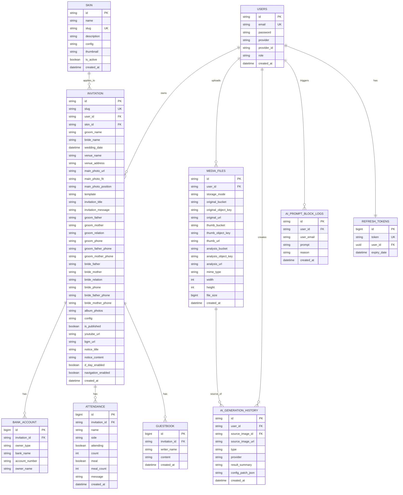

# ERD

현재 문서는 `자바 엔티티 + 실제 DB 컬럼`이 함께 존재하는 과도기 구조 기준입니다.

- 관계선: 현재 JPA 관계 기준
- 속성명: 실제 DB 컬럼명 기준으로 읽기 쉽게 표기
- 타입: 자바 엔티티 필드 타입 기준

## 핵심 관계

- `invitation.user_id -> users.id`
- `invitation.skin_id -> skin.id`
- `bank_account.invitation_id -> invitation.id`
- `attendance.invitation_id -> invitation.id`
- `guestbook.invitation_id -> invitation.id`
- `refresh_tokens.user_id -> users.id`
- `media_files.user_id -> users.id`
- `ai_generation_history.user_id -> users.id`
- `ai_generation_history.source_image_id -> media_files.id`
- `ai_prompt_block_logs.user_id -> users.id`

## 메모

- 현재 코드는 `관계 객체`와 `문자열 id 컬럼`을 함께 유지하는 과도기 구조입니다.
- 예: `Invitation.skinId` 와 `Invitation.skin`, `MediaFile.userId` 와 `MediaFile.user`
- 즉 이 문서는 "순수 엔티티 필드만" 정리한 문서가 아니라, 현재 운영 구조 설명용 ERD입니다.
- `refresh_tokens`는 현재 코드 기준 `User 1 : 1 RefreshToken` 입니다.
- 운영 DB에 FK 제약을 추가하기 전 orphan 데이터 점검이 필요합니다.
- 관련 SQL:
- [db-orphan-check.sql](/Users/freemanyoo/Library/CloudStorage/SynologyDrive-develop/Wedding Invitation/WEDDING_WEB/docs/db-orphan-check.sql)
- [db-fk-migration.sql](/Users/freemanyoo/Library/CloudStorage/SynologyDrive-develop/Wedding Invitation/WEDDING_WEB/docs/db-fk-migration.sql)
