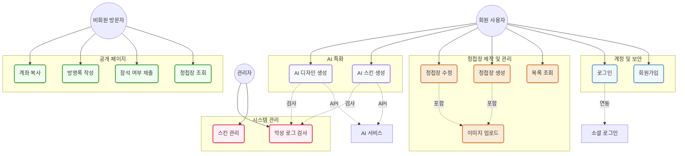

# Use Case Diagram

```mermaid
flowchart TB
    Guest((비회원 방문자))
    User((회원 사용자))
    Admin((관리자))
    Social[소셜 로그인]
    AIS[AI 서비스]

    classDef auth fill:AliceBlue,stroke:SteelBlue,stroke-width:2px;
    classDef manage fill:AntiqueWhite,stroke:Chocolate,stroke-width:2px;
    classDef public fill:Honeydew,stroke:ForestGreen,stroke-width:2px;
    classDef ai fill:GhostWhite,stroke:MediumPurple,stroke-width:2px;
    classDef admin fill:LavenderBlush,stroke:Crimson,stroke-width:2px;

    subgraph G1 [계정 및 보안]
        direction LR
        UC01(회원가입)
        UC02(로그인)
    end

    subgraph G2 [청첩장 제작 및 관리]
        direction LR
        UC03(목록 조회)
        UC04(청첩장 생성)
        UC05(청첩장 수정)
        UC14(이미지 업로드)
    end

    subgraph G3 [공개 페이지]
        direction LR
        UC07(청첩장 조회)
        UC08(참석 여부 제출)
        UC09(방명록 작성)
        UC10(계좌 복사)
    end

    subgraph G4 [AI 특화]
        direction LR
        UC12(AI 스킨 생성)
        UC13(AI 디자인 생성)
    end

    subgraph G5 [시스템 관리]
        direction LR
        UC15(스킨 관리)
        UC16(악성 로그 검사)
    end

    Guest --> UC07
    Guest --> UC08
    Guest --> UC09
    Guest --> UC10

    User --> UC01
    User --> UC02
    User --> UC03
    User --> UC04
    User --> UC05
    User --> UC12
    User --> UC13

    Admin --> UC15
    Admin --> UC16

    UC02 -.->|연동| Social
    UC12 -.->|API| AIS
    UC13 -.->|API| AIS
    UC04 -.->|포함| UC14
    UC05 -.->|포함| UC14
    UC12 -.->|검사| UC16
    UC13 -.->|검사| UC16

    class UC01,UC02 auth;
    class UC03,UC04,UC05,UC14 manage;
    class UC07,UC08,UC09,UC10 public;
    class UC12,UC13 ai;
    class UC15,UC16 admin;
```
